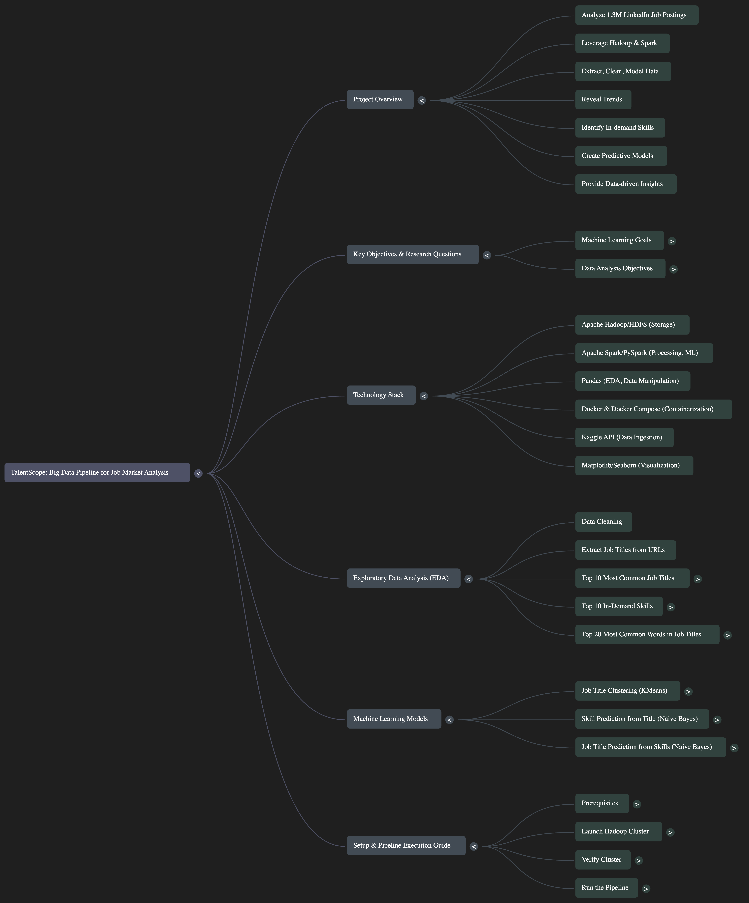
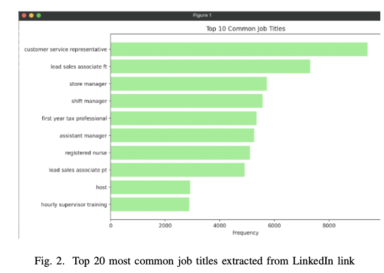
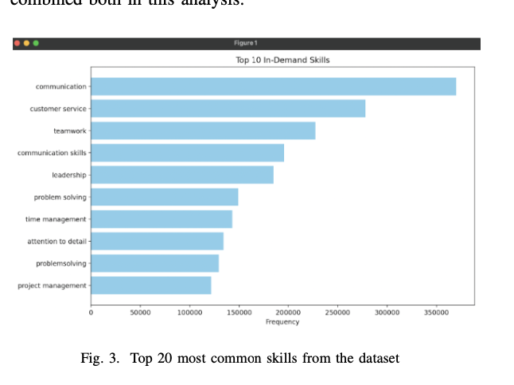
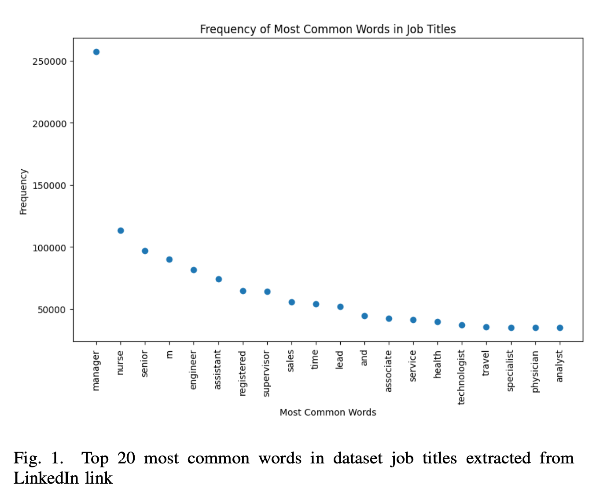
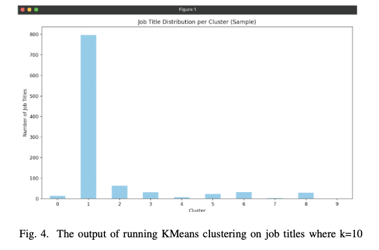
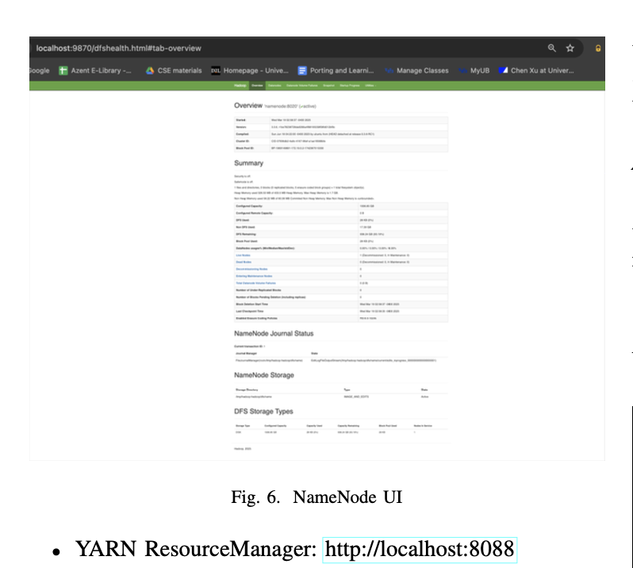
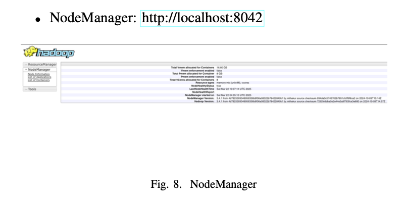
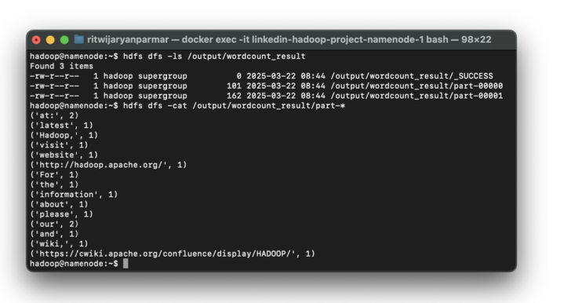

# TalentScope: A Big Data Pipeline for Job Market Analysis


An end-to-end big data pipeline engineered on a Hadoop and Spark cluster to ingest, process, and analyze the "1.3M LinkedIn Jobs & Skills (2024)" dataset, uncovering deep insights into the professional job market.

---

## 🎯 Project Overview

Navigating the modern job market is a complex challenge for both job seekers and employers. This project tackles this challenge by building a high-performance data pipeline to analyze over 1.3 million LinkedIn job postings. By leveraging distributed computing with Apache Hadoop and Spark, this project extracts, cleans, and models vast amounts of data to reveal trends in job availability, identify in-demand skills, and create predictive models that can match candidates to suitable roles. The ultimate goal is to provide data-driven insights that make the job market more transparent and easier to navigate.

## ⚙️ Project Architecture

This flowchart provides a high-level overview of the project's structure, from the main objectives to the technology stack and pipeline stages.



## 📋 Key Objectives & Research Questions

This project aims to answer several key questions through data analysis and machine learning.

#### Machine Learning Goals
1.  **Job Title Clustering**: How many distinct clusters (job categories) exist within the dataset? This unsupervised learning task groups similar job titles, helping to recommend adjacent career paths.
2.  **Skill Prediction**: Given a job title, what specific skills are employers looking for? This supervised model helps candidates identify skills they need to develop for a target role.
3.  **Job Title Prediction**: Given a set of skills, what job title is a candidate most qualified for? This model helps job seekers match their skills to available positions.

#### Data Analysis Objectives
1.  Analyze the correlation between job title complexity and the number of required skills.
2.  Identify the most in-demand skills across all industries.
3.  Pinpoint jobs with the highest frequency of openings, indicating potential labor shortages.
4.  Discover which skills are most frequently listed together.
5.  Detect and analyze duplicate job postings to understand hiring patterns.

## 🛠️ Technology Stack

* **Apache Hadoop/HDFS**: For robust, distributed, and fault-tolerant storage of large datasets.
* **Apache Spark/PySpark**: For large-scale, in-memory parallel data processing, cleaning, and machine learning.
* **Pandas**: For initial local exploratory data analysis and data manipulation.
* **Docker & Docker Compose**: For containerizing the Hadoop ecosystem, ensuring a consistent and reproducible environment.
* **Kaggle API**: For programmatic data ingestion directly from the source.
* **Matplotlib/Seaborn**: For data visualization.

## 📊 Exploratory Data Analysis (EDA)

The initial analysis involved cleaning the data, extracting readable job titles from URL strings, and identifying key trends.

**Top 10 Most Common Job Titles:**
The most frequent job opening is "customer service representative," which is logical given its presence across many industries. Managerial and service sector roles are also highly common.


**Top 10 In-Demand Skills:**
"Communication" stands out as the most sought-after skill, followed closely by customer service and teamwork, underscoring the value of soft skills in today's job market.


**Top 20 Most Common Words in Job Titles:**
The word "manager" is the most common, appearing across nearly all industries. "Nurse" is also highly frequent, pointing to high demand in the healthcare sector.


## 🤖 Machine Learning Models

Three machine learning models were developed to address the project's key objectives.

#### 1. Job Title Clustering (KMeans)
An unsupervised KMeans clustering model was used to group job titles into 10 distinct categories. The results show a large primary cluster with several smaller, more specialized clusters, revealing the underlying structure of the job market.



#### 2. Skill Prediction from Title (Naive Bayes)
A Naive Bayes classifier was trained to predict the most likely skills required for a given job title. This model serves as a tool for candidates to understand skill expectations for different roles.

#### 3. Job Title Prediction from Skills (Naive Bayes)
A second Naive Bayes classifier was developed to predict the most suitable job title based on a list of skills. This model acts as a recommendation engine for job seekers, matching their abilities to open positions.

## 🚀 Setup & Pipeline Execution Guide

This guide outlines the steps to set up the environment and run the data pipeline.

### 1. Prerequisites
* [Docker Desktop](https://www.docker.com/products/docker-desktop/) must be installed and running.

### 2. Launch the Hadoop Cluster
1.  Clone this repository.
2.  Navigate to the project directory in your terminal.
3.  Use the provided `docker-compose.yaml` and `config` files to launch the cluster:
    ```bash
    docker-compose up -d
    ```

### 3. Verify the Cluster
Confirm that the Hadoop services are running correctly by checking the Docker containers and accessing the web UIs.

* **Check running containers:**
    ```bash
    docker ps
    ```
* **Access Web Interfaces:**
    * **HDFS NameNode:** `http://localhost:9870`
        
    * **YARN NodeManager:** `http://localhost:8042`
        

### 4. Run the Pipeline
1.  **Data Ingestion:** Use the provided scripts to download the dataset from Kaggle and upload it to HDFS.
2.  **Data Processing & Analysis:** Execute the `job_analysis.py` Spark script to clean the data and perform EDA.
3.  **Machine Learning:** Run the three ML scripts to train the models on the processed data.

*Example of checking Spark job results in HDFS:*
